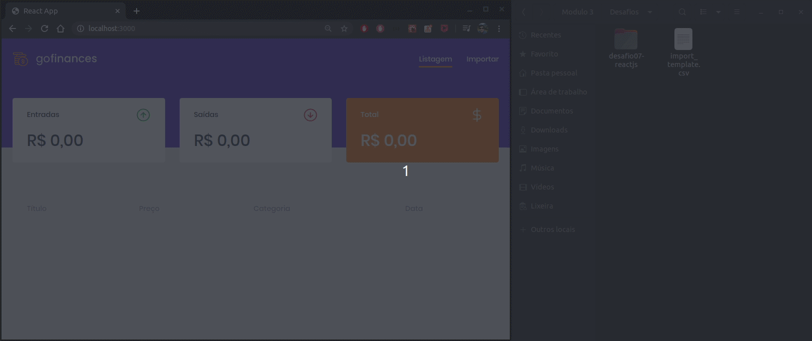

# desafio07-reactjs
Desafio elaborado para praticar ReactJs durante o GoStack

<h2>Objetivo</h2>

Consumir a API criada no https://github.com/Gasorey/Desafio-node-finance
  Onde o usuário consegue importar um arquivo no formato CSV contendo suas transações.
  E elas serão listadas na página inicial do projeto

<h2>Tecnologias</h2>
<ul>
  <li>React JS</li>
  <li>Styled Components</li>
  <li>Drop Zone</li>
  <li>React Router DOM</li>
</ul>
